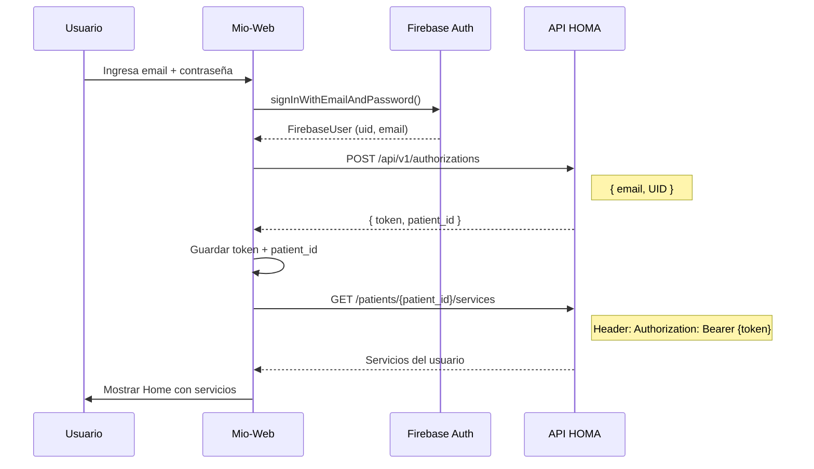

# 📡 API HOMA - Documentación de Endpoints

**Base URL**: `https://apihoma.homa.cl:7200`  
**Documentación Swagger**: `https://apihoma.homa.cl:7200/#/`

---

## 🔐 Autenticación

### POST `/api/v1/authorizations`

Autoriza un usuario de Firebase en el backend HOMA.

**Request Body:**

```json
{
  "email": "a@a.cl",
  "UID": "GFGttgUIYglyIIsoFhuyTuytuy"
}
```

**Response 200:**

```json
{
  "success": true,
  "token": "asdgae0kjfdF",
  "expiresIn": 86400,
  "patient_id": 12345,
  "error": "Email o UID incorrectos."
}
```

| Campo        | Tipo    | Descripción                          |
| ------------ | ------- | ------------------------------------ |
| `success`    | boolean | Si la autorización fue exitosa       |
| `token`      | string  | Token JWT para llamadas subsecuentes |
| `expiresIn`  | number  | Tiempo de expiración en segundos     |
| `patient_id` | number  | ID del paciente en el sistema HOMA   |
| `error`      | string  | Mensaje de error si falla            |

---

## 👤 Pacientes

### POST `/api/v1/patients`

Crea un nuevo paciente en el sistema.

**Request Body:**

```json
{
  "email": "a@a.cl",
  "uid": "adsgdeuyagdfIsuyd",
  "fname": "Juan",
  "lname": "Perez",
  "document_type": "1",
  "document": "11111111-1",
  "alt_email": "a@a.cl",
  "comments": "asdf",
  "birthday": "1990-01-01"
}
```

| Campo           | Tipo   | Descripción                          |
| --------------- | ------ | ------------------------------------ |
| `email`         | string | Email principal                      |
| `uid`           | string | UID de Firebase                      |
| `fname`         | string | Nombre                               |
| `lname`         | string | Apellido                             |
| `document_type` | string | Tipo de documento (1 = RUT)          |
| `document`      | string | Número de documento (RUT formateado) |
| `alt_email`     | string | Email alternativo                    |
| `comments`      | string | Comentarios                          |
| `birthday`      | string | Fecha de nacimiento (YYYY-MM-DD)     |

---

### GET `/api/v1/patients`

Obtiene pacientes filtrados por Firebase ID.

**Query Parameters:**
| Parámetro | Tipo | Requerido | Descripción |
|-----------|------|-----------|-------------|
| `firebase_id` | string | Sí | UID de Firebase |

**Responses:**

- `200` - OK
- `400` - Bad Request
- `500` - Internal Server Error

---

### GET `/api/v1/patients/{patient_id}`

Obtiene información de un paciente específico.

**Path Parameters:**
| Parámetro | Tipo | Requerido | Descripción |
|-----------|------|-----------|-------------|
| `patient_id` | string | Sí | ID del paciente |

---

### GET `/api/v1/patients/{patient_id}/campaigns`

Obtiene las campañas asociadas a un paciente.

**Path Parameters:**
| Parámetro | Tipo | Requerido | Descripción |
|-----------|------|-----------|-------------|
| `patient_id` | string | Sí | ID del paciente |

---

### GET `/api/v1/patients/{patient_id}/services` ⭐

**Este es el endpoint clave para los servicios dinámicos.**

Obtiene los servicios disponibles para un paciente según su plan.

**Path Parameters:**
| Parámetro | Tipo | Requerido | Descripción |
|-----------|------|-----------|-------------|
| `patient_id` | string | Sí | ID del paciente |

---

### POST `/api/v1/patients/setcampaing`

Asigna una campaña a un paciente.

**Request Body:**

```json
{
  "patientId": 1,
  "campaignId": 1
}
```

---

## 📅 Planes y Suscripciones

### GET `/api/v1/patients/plans/{patient_id}`

Obtiene el plan actual del paciente.

**Path Parameters:**
| Parámetro | Tipo | Requerido | Descripción |
|-----------|------|-----------|-------------|
| `patient_id` | string | Sí | ID del paciente |

---

### GET `/api/v1/patients/more_plans/{patient_id}`

Obtiene planes adicionales disponibles para el paciente.

**Path Parameters:**
| Parámetro | Tipo | Requerido | Descripción |
|-----------|------|-----------|-------------|
| `patient_id` | string | Sí | ID del paciente |

---

### PUT `/api/v1/patients/plans/{patient_id}/{plan_id}`

Actualiza el plan del paciente.

**Path Parameters:**
| Parámetro | Tipo | Requerido | Descripción |
|-----------|------|-----------|-------------|
| `patient_id` | string | Sí | ID del paciente |
| `plan_id` | string | Sí | ID del nuevo plan |

---

## 📺 Contenido Multimedia

### GET `/api/v1/patients/material_audiovisual/{patient_id}`

Obtiene material audiovisual asignado al paciente.

**Path Parameters:**
| Parámetro | Tipo | Requerido | Descripción |
|-----------|------|-----------|-------------|
| `patient_id` | string | Sí | ID del paciente |

---

## 📧 Comunicaciones

### POST `/api/v1/sendEmailTemplate`

Envía un email usando un template de SendGrid (o similar).

**Request Body:**

```json
{
  "from": "comunicaciones@accuhealth.cl",
  "to": [{ "email": "usuario@ejemplo.cl" }],
  "dynamicTemplateData": { "name": "Alejandro" },
  "templateId": "d-4720...",
  "subject": "Prueba",
  "attachments": ""
}
```

### POST `/api/v1/sendEmailHtml`

Envía un email con cuerpo HTML directo.

**Request Body:**

```json
{
  "from": "comunicaciones@accuhealth.cl",
  "to": [{ "email": "usuario@ejemplo.cl" }],
  "subject": "Prueba",
  "htmlBody": "",
  "attachments": ""
}
```

---

## 📈 Uso de Servicios

### POST `/api/v1/services/setuseservice`

Registra el uso de un servicio por parte del paciente.

**Request Body:**

```json
{
  "patient_id": 123456,
  "service_id": 1,
  "quantity_used": 1
}
```

### POST `/api/v1/services/setuseserviceclickup/{service}/{document}`

Registra uso de servicio específico (¿integración ClickUp?).

**Path Parameters:**
| Parámetro | Tipo | Requerido | Descripción |
|-----------|------|-----------|-------------|
| `service` | string | Sí | Nombre del servicio |
| `document` | string | Sí | Documento del usuario |

---

## 🔄 Flujo de Autenticación Completo



---

## 🔧 Configuración Firebase

**Project ID**: `homa-prod-fbb80`  
**Service Account**: Para autenticación backend (NO usar en frontend)

### Cliente Firebase (Frontend)

```javascript
// Configuración para Firebase Auth en el frontend
const firebaseConfig = {
  // TODO: Obtener de Cristóbal las credenciales del cliente web
  apiKey: "...",
  authDomain: "homa-prod-fbb80.firebaseapp.com",
  projectId: "homa-prod-fbb80",
};
```

> [!IMPORTANT]
> El service account `homa-prod-fbb80-firebase-adminsdk-*.json` es para **backend-to-backend**.
> Para el frontend necesitamos las credenciales del **Firebase Web Client**.

---

## ❓ Preguntas Pendientes para Cristóbal

1. **¿Cuáles son las credenciales de Firebase para el cliente web?**
   - apiKey, authDomain, etc.

2. **¿Cómo es la estructura del response de `/patients/{patient_id}/services`?**
   - ¿Qué campos tiene cada servicio?
   - ¿Incluye el componente a renderizar?

3. **¿El token de `/authorizations` debe ir en el header Authorization para las demás llamadas?**

4. **¿Hay endpoint de registro o solo login?**
